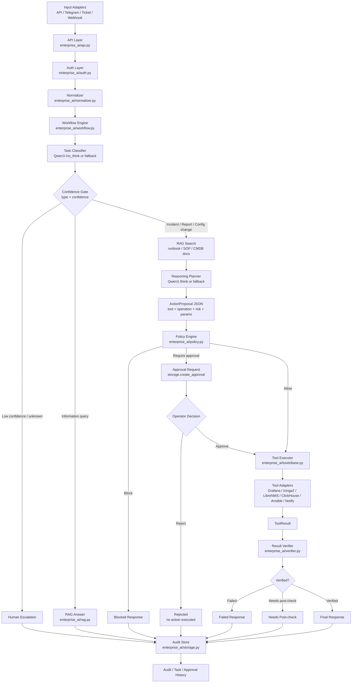
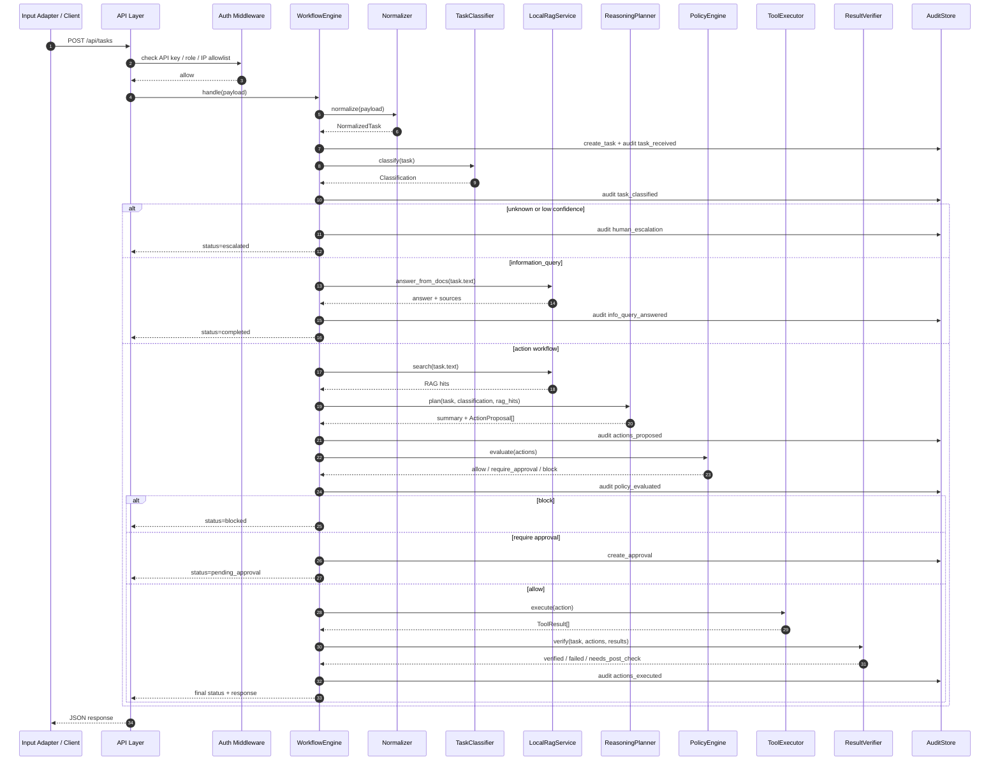
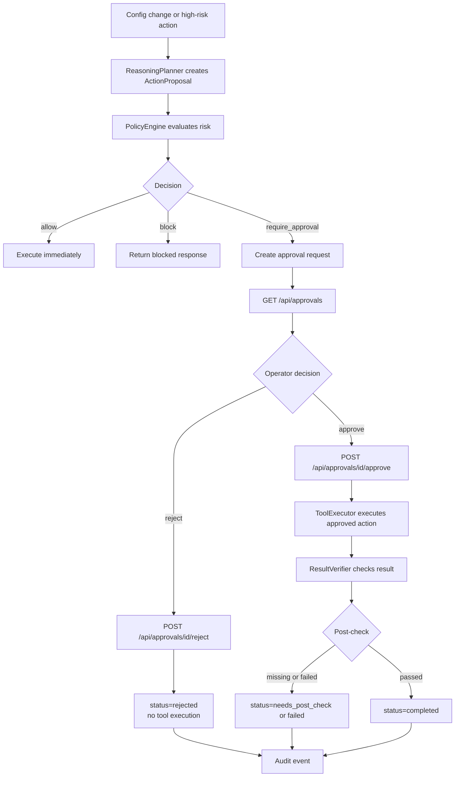
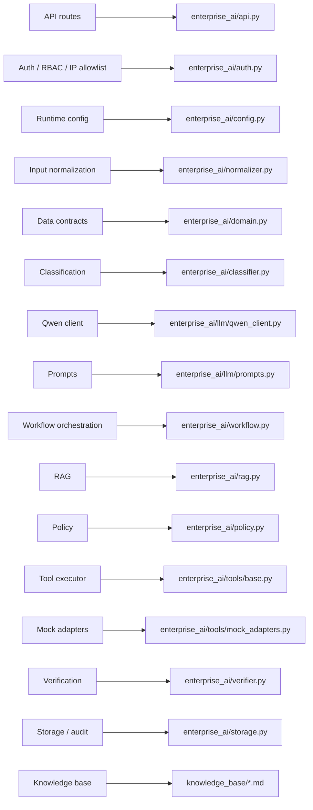
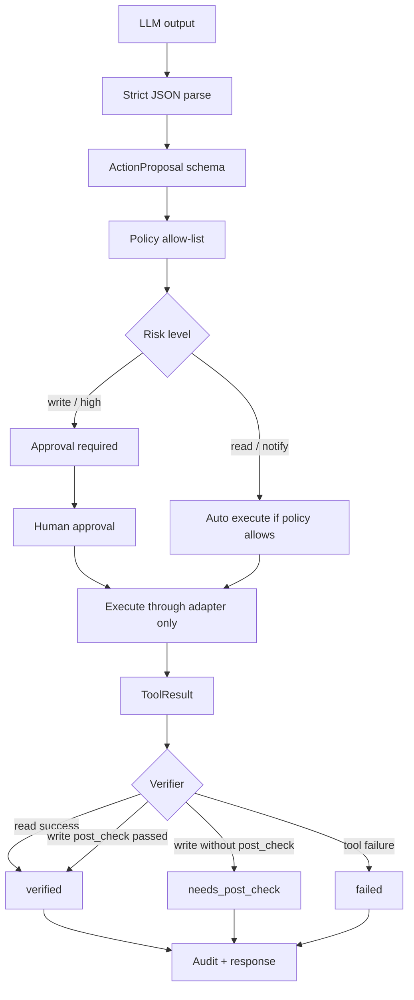
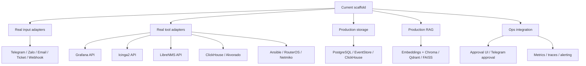

# Flow Diagram

File nay mo ta luong xu ly cua du an bang Mermaid. GitHub se render cac khoi `mermaid` thanh bieu do truc tiep.

## 1. Overall Architecture Flow

## 2. Task Processing Sequence

## 3. Approval Flow

## 4. Component To Source Map

## 5. Safety Gate View

## 6. Production Extension Path

